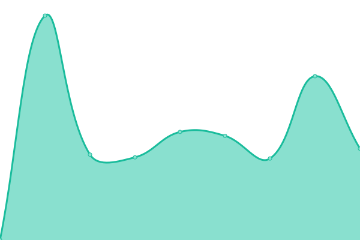

# [📈 Live Status](https://charlotte.corcd.xyz): <!--live status--> **🟧 Partial outage**

This repository contains the open-source uptime monitor and status page for [Whzcorcd](https://corcd.xyz), powered by [Upptime](https://github.com/upptime/upptime).

With [Upptime](https://upptime.js.org), you can get your own unlimited and free uptime monitor and status page, powered entirely by a GitHub repository. We use [Issues](https://github.com/corcd/charlotte/issues) as incident reports, [Actions](https://github.com/corcd/charlotte/actions) as uptime monitors, and [Pages](https://charlotte.corcd.xyz) for the status page.

<!--start: status pages-->
<!-- This summary is generated by Upptime (https://github.com/upptime/upptime) -->
<!-- Do not edit this manually, your changes will be overwritten -->
<!-- prettier-ignore -->
| URL | Status | History | Response Time | Uptime |
| --- | ------ | ------- | ------------- | ------ |
|  [Corcd Blog](https://www.corcd.xyz) | 🟥 Down | [corcd-blog.yml](https://github.com/corcd/charlotte/commits/HEAD/history/corcd-blog.yml) | 

 0ms
     
 | 

<a href="https://charlotte.corcd.xyz/history/corcd-blog">0.00%</a>
    

|  [Guangdianyun](https://www.guangdianyun.tv) | 🟩 Up | [guangdianyun.yml](https://github.com/corcd/charlotte/commits/HEAD/history/guangdianyun.yml) | 

 3681ms
     
 | 

<a href="https://charlotte.corcd.xyz/history/guangdianyun">69.28%</a>
    

|  [Guangdianyun Consoles](https://consoles.guangdianyun.tv) | 🟥 Down | [guangdianyun-consoles.yml](https://github.com/corcd/charlotte/commits/HEAD/history/guangdianyun-consoles.yml) | 

 2161ms
     
 | 

<a href="https://charlotte.corcd.xyz/history/guangdianyun-consoles">70.47%</a>
    

<!--end: status pages-->

[**Visit our status website →**](https://charlotte.corcd.xyz)

## 📄 License

- Powered by: [Upptime](https://github.com/upptime/upptime)
- Code: [MIT](./LICENSE) © [Whzcorcd](https://corcd.xyz)
- Data in the `./history` directory: [Open Database License](https://opendatacommons.org/licenses/odbl/1-0/)
